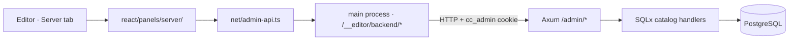

# Server console overview

The **Server** tab in the AsteronEngine editor is the operator console for the
ClaudeCitizen Rust backend. It lets you inspect registered players and manage the
**game catalog** — ship, prop, item, weapon, backpack, and wearable definitions —
plus global **game settings** such as starting ARC balance and starter loadouts.

Catalog rows live in **that backend’s Postgres** only. They do not ship with
Build Web, and local Console edits do not auto-sync to production. How project
files, catalog, and migrations relate:
[Content delivery](../architecture/content-delivery).

The rest of the editor authors **project files** (scenes, prefabs, planets). The
Server tab is the one place that edits **persistent server data** stored in
PostgreSQL, live against a deployed backend.

## What you can do

| Area | Capabilities |
| --- | --- |
| **Users** | Browse accounts and inspect player state (read only) |
| **Ships** | Create and edit ship definitions tied to bundled ship prefabs |
| **Props** | Create and edit hangar/apartment decoration definitions |
| **Items** | Create, edit, and delete inventory item definitions |
| **Weapons** | Firearm definitions — damage, magazine, fire modes, ammo pairing |
| **Backpacks** | Carry containers and their capacity |
| **Wearables** | Equippable apparel and armor |
| **Game settings** | Configure starting ARC and starter ship/prop/item loadouts |

## Architecture

The console is a React panel mounted as an editor tab. Requests are forwarded by
the Electron main process, which holds the `cc_admin` cookie — the renderer's
`cceditor://app` origin cannot store it and would fail the backend's CORS check.

| Path | Role |
| --- | --- |
| `src/editor/react/panels/server/` | Console UI — login, sidebar, and one panel per catalog area |
| `src/net/admin-api.ts` | Typed fetch helpers for `/admin/*` endpoints |
| `editor-desktop/main.mjs` | `/__editor/backend/*` proxy to the configured backend |
| `backend/crates/server/src/admin.rs` | Admin session, users, catalog, and settings handlers |
| `backend/crates/server/src/game.rs` | Player bootstrap, inventory/loadout, and build persistence |

## When you need it

Use the Server console when you are running the full online stack
(`npm run dev:infra` + a running backend) and want to:

- Seed or tune ship/prop/item catalogs before players sign in
- Adjust what new players receive on first bootstrap
- Inspect account and ship ownership during development

Offline playtesting in the editor does **not** require it. See
[Getting started](./getting-started) to open it.

## Related docs

- [Content delivery](../architecture/content-delivery) — Build Web vs catalog vs migrations
- [Getting started](./getting-started) — boot URL, prerequisites, and local setup
- [Authentication](./authentication) — credentials, session cookies, and security
- [Users](./users) — account inspection
- [Ship definitions](./ship-definitions) — playable ship catalog
- [Prop definitions](./prop-definitions) — hangar decoration catalog
- [Item definitions](./item-definitions) — inventory catalog, including weapons, backpacks, and wearables
- [Game settings](./game-settings) — ARC and starter loadouts
- [API reference](./api-reference) — REST endpoints
